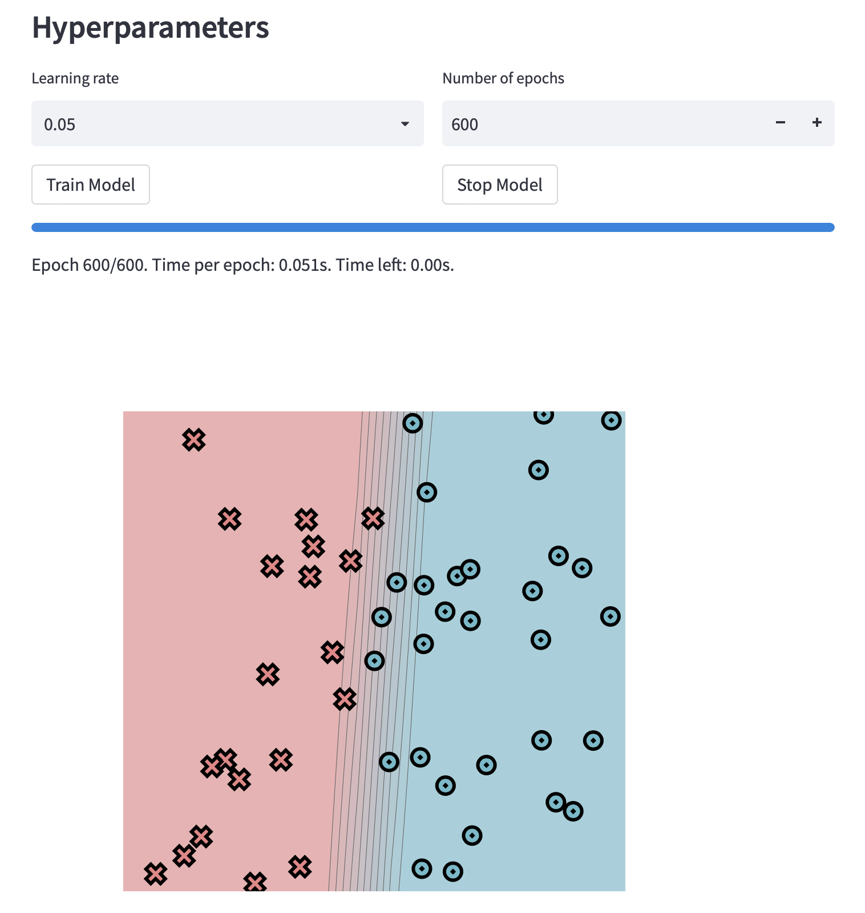
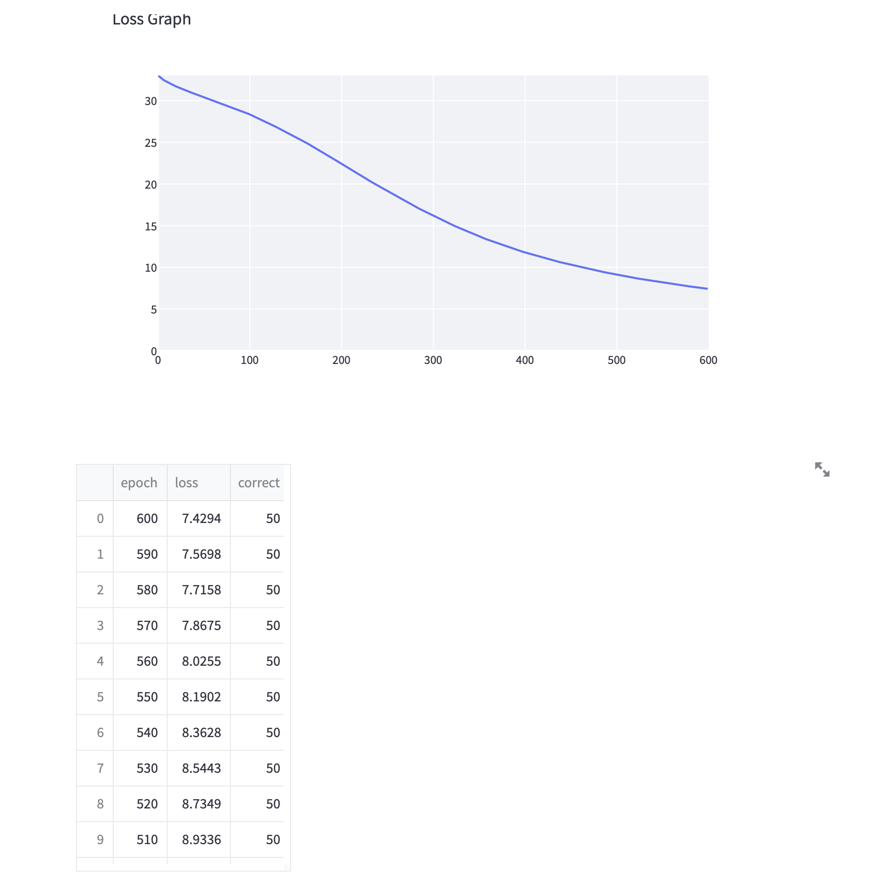
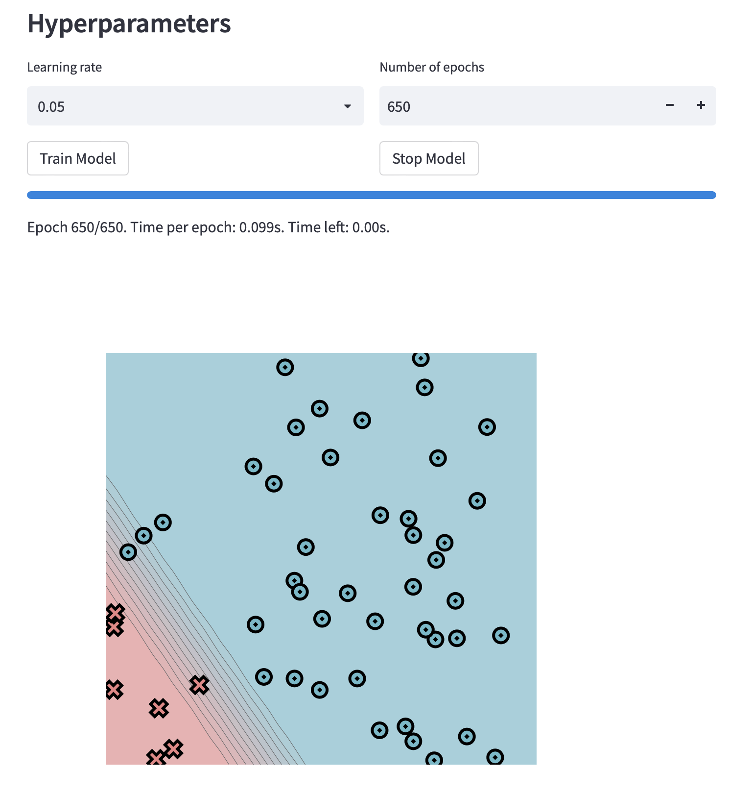
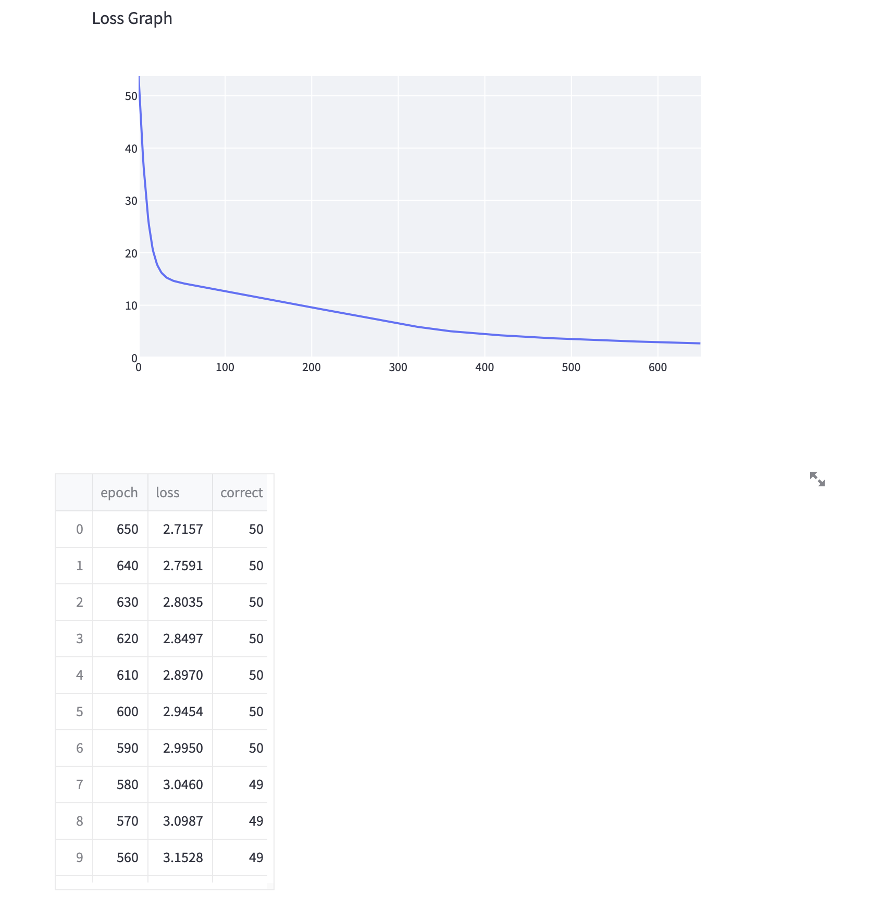
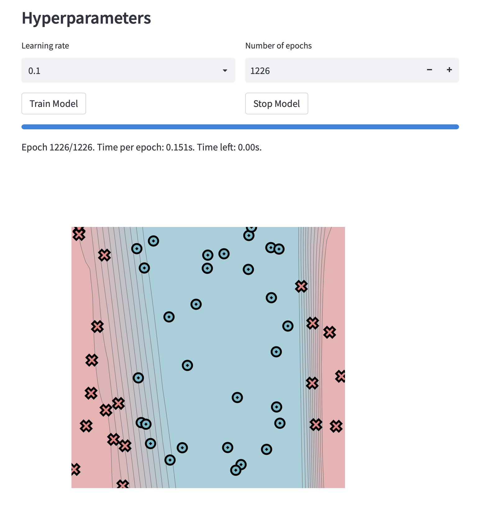
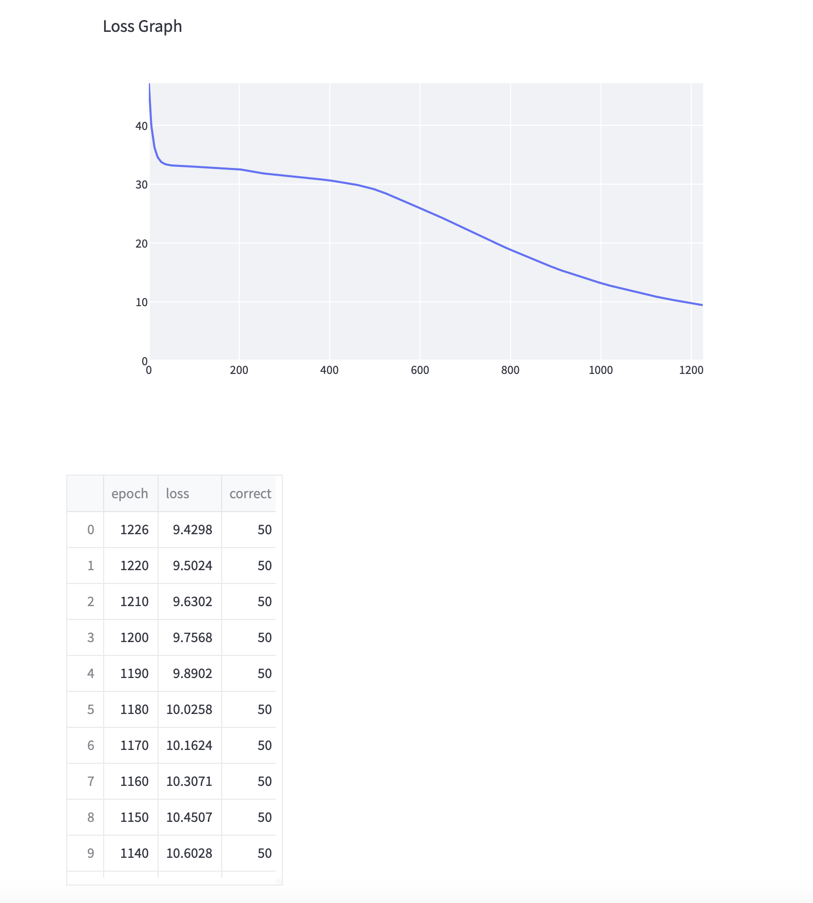
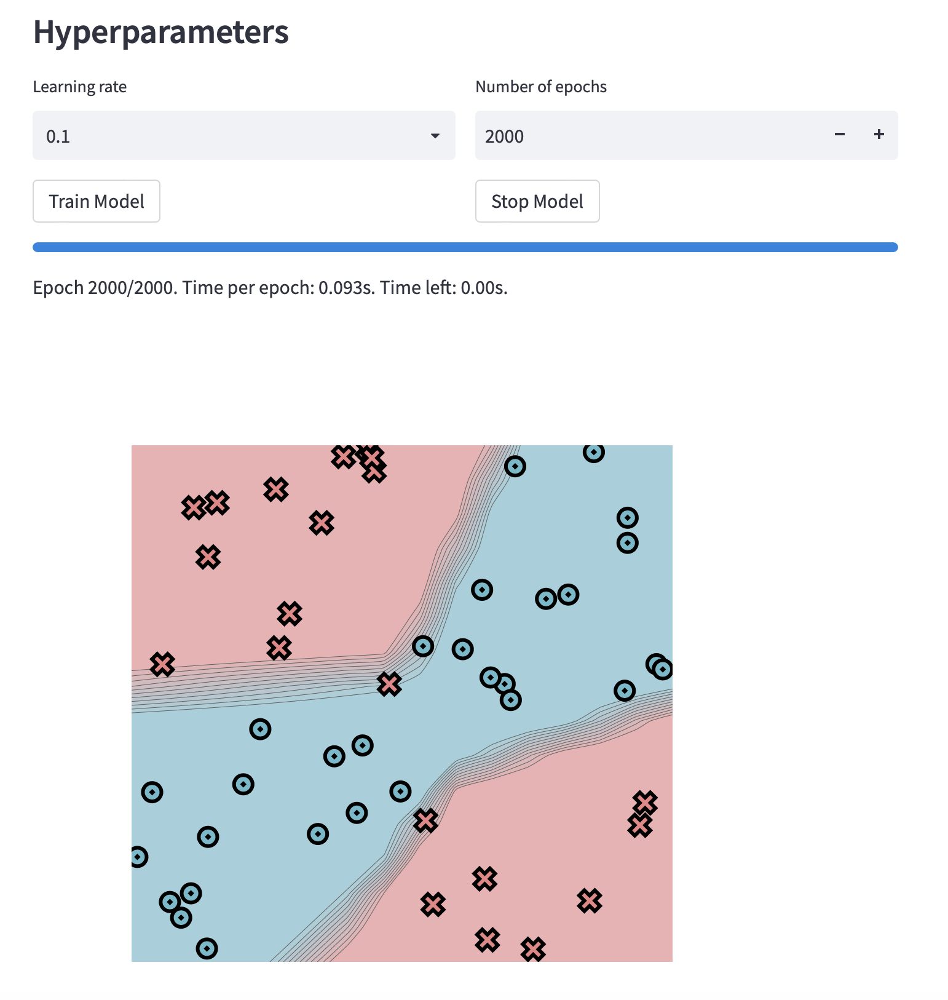
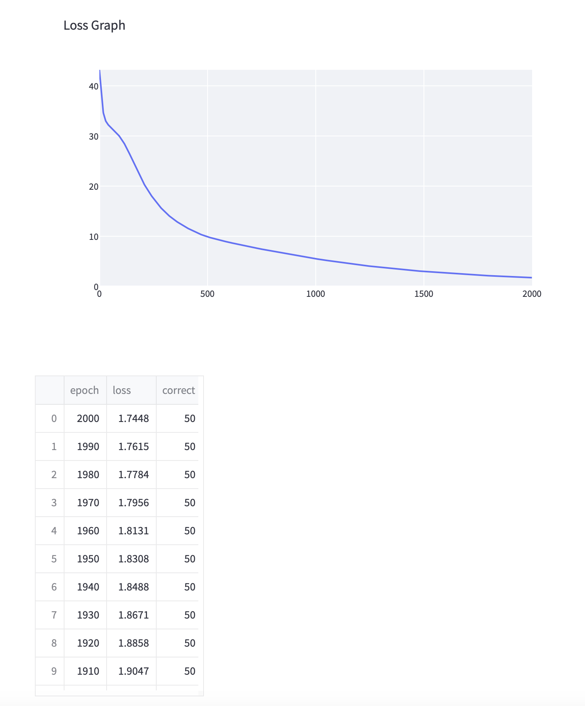

[](https://classroom.github.com/a/YFgwt0yY)
# MiniTorch Module 2


* Docs: https://minitorch.github.io/

* Overview: https://minitorch.github.io/module2/module2/

This assignment requires the following files from the previous assignments. You can get these by running

```bash
python sync_previous_module.py previous-module-dir current-module-dir
```

The files that will be synced are:

        minitorch/operators.py minitorch/module.py minitorch/autodiff.py minitorch/scalar.py minitorch/scalar_functions.py minitorch/module.py project/run_manual.py project/run_scalar.py project/datasets.py


##Task 2.5

**Simple Dataset**

Size of hidden layer: 2
Time per epoch: About 0.047s - 0.051s

Training Log:
```
Epoch: 0/600, loss: 0, correct: 0
Epoch: 10/600, loss: 32.29406449505168, correct: 30
Epoch: 20/600, loss: 31.738451762012936, correct: 30
Epoch: 30/600, loss: 31.27053594376299, correct: 30
Epoch: 40/600, loss: 30.860446707245845, correct: 30
Epoch: 50/600, loss: 30.48027518949726, correct: 30
Epoch: 60/600, loss: 30.095360411016344, correct: 31
Epoch: 70/600, loss: 29.70425511609232, correct: 32
Epoch: 80/600, loss: 29.296790747073356, correct: 33
Epoch: 90/600, loss: 28.864257430903216, correct: 34
Epoch: 100/600, loss: 28.397620039998326, correct: 37
Epoch: 110/600, loss: 27.897033167860837, correct: 42
Epoch: 120/600, loss: 27.369307410829084, correct: 43
Epoch: 130/600, loss: 26.82666174716582, correct: 43
Epoch: 140/600, loss: 26.27081973479122, correct: 45
Epoch: 150/600, loss: 25.692207739206168, correct: 46
Epoch: 160/600, loss: 25.095484586685203, correct: 47
Epoch: 170/600, loss: 24.480787095314888, correct: 47
Epoch: 180/600, loss: 23.840106214431547, correct: 47
Epoch: 190/600, loss: 23.172772056296864, correct: 47
Epoch: 200/600, loss: 22.48608833797984, correct: 47
Epoch: 210/600, loss: 21.804955432634337, correct: 48
Epoch: 220/600, loss: 21.133287265818826, correct: 49
Epoch: 230/600, loss: 20.474270564638147, correct: 49
Epoch: 240/600, loss: 19.83603578663352, correct: 49
Epoch: 250/600, loss: 19.20784508727253, correct: 49
Epoch: 260/600, loss: 18.584114375625216, correct: 49
Epoch: 270/600, loss: 17.965757235080055, correct: 49
Epoch: 280/600, loss: 17.36525766775685, correct: 50
Epoch: 290/600, loss: 16.7890017478159, correct: 50
Epoch: 300/600, loss: 16.22673095504295, correct: 50
Epoch: 310/600, loss: 15.683478653458684, correct: 50
Epoch: 320/600, loss: 15.173542500663771, correct: 50
Epoch: 330/600, loss: 14.68262389310184, correct: 50
Epoch: 340/600, loss: 14.209141933457353, correct: 50
Epoch: 350/600, loss: 13.753661683841191, correct: 50
Epoch: 360/600, loss: 13.324997704210585, correct: 50
Epoch: 370/600, loss: 12.922517648188261, correct: 50
Epoch: 380/600, loss: 12.537280232042718, correct: 50
Epoch: 390/600, loss: 12.168619585746848, correct: 50
Epoch: 400/600, loss: 11.816980837140097, correct: 50
Epoch: 410/600, loss: 11.487492373093717, correct: 50
Epoch: 420/600, loss: 11.176711587656682, correct: 50
Epoch: 430/600, loss: 10.880476321696008, correct: 50
Epoch: 440/600, loss: 10.597348773485166, correct: 50
Epoch: 450/600, loss: 10.326724944377329, correct: 50
Epoch: 460/600, loss: 10.068023166729324, correct: 50
Epoch: 470/600, loss: 9.82066727780943, correct: 50
Epoch: 480/600, loss: 9.584091710911236, correct: 50
Epoch: 490/600, loss: 9.357745793864588, correct: 50
Epoch: 500/600, loss: 9.141097040742562, correct: 50
Epoch: 510/600, loss: 8.933633542035404, correct: 50
Epoch: 520/600, loss: 8.734865577226905, correct: 50
Epoch: 530/600, loss: 8.544326573587295, correct: 50
Epoch: 540/600, loss: 8.362776611488217, correct: 50
Epoch: 550/600, loss: 8.1901811336942, correct: 50
Epoch: 560/600, loss: 8.02549441657101, correct: 50
Epoch: 570/600, loss: 7.867547013760952, correct: 50
Epoch: 580/600, loss: 7.71578049182769, correct: 50
Epoch: 590/600, loss: 7.569843948592655, correct: 50
Epoch: 600/600, loss: 7.429409965114287, correct: 50
```





**Diag Dataset**


Size of hidden layer: 4
Time per epoch: About 0.096s - 0.100s

Training Log:
```
Epoch: 0/650, loss: 0, correct: 0
Epoch: 10/650, loss: 29.905679509295553, correct: 45
Epoch: 20/650, loss: 18.946457952721644, correct: 43
Epoch: 30/650, loss: 15.737396299882004, correct: 43
Epoch: 40/650, loss: 14.726281516522718, correct: 43
Epoch: 50/650, loss: 14.266153085563648, correct: 43
Epoch: 60/650, loss: 13.944172319282455, correct: 43
Epoch: 70/650, loss: 13.65345726453161, correct: 43
Epoch: 80/650, loss: 13.365184198881273, correct: 43
Epoch: 90/650, loss: 13.071491316445183, correct: 43
Epoch: 100/650, loss: 12.770369691888057, correct: 43
Epoch: 110/650, loss: 12.461529083424104, correct: 43
Epoch: 120/650, loss: 12.145259493943101, correct: 43
Epoch: 130/650, loss: 11.822126984458587, correct: 43
Epoch: 140/650, loss: 11.492900681041471, correct: 43
Epoch: 150/650, loss: 11.161431762910146, correct: 43
Epoch: 160/650, loss: 10.849237082188194, correct: 43
Epoch: 170/650, loss: 10.536172719091978, correct: 43
Epoch: 180/650, loss: 10.222901513922055, correct: 43
Epoch: 190/650, loss: 9.910447514619822, correct: 43
Epoch: 200/650, loss: 9.599952444208295, correct: 43
Epoch: 210/650, loss: 9.295565211846743, correct: 43
Epoch: 220/650, loss: 9.003935079371203, correct: 43
Epoch: 230/650, loss: 8.71810285315555, correct: 45
Epoch: 240/650, loss: 8.421129183957452, correct: 45
Epoch: 250/650, loss: 8.11858306070514, correct: 45
Epoch: 260/650, loss: 7.827759190440515, correct: 47
Epoch: 270/650, loss: 7.530554895792988, correct: 48
Epoch: 280/650, loss: 7.193866078835279, correct: 49
Epoch: 290/650, loss: 6.848191987310387, correct: 49
Epoch: 300/650, loss: 6.532246705219793, correct: 49
Epoch: 310/650, loss: 6.241486585852478, correct: 49
Epoch: 320/650, loss: 5.960144862651276, correct: 49
Epoch: 330/650, loss: 5.698903244223165, correct: 49
Epoch: 340/650, loss: 5.45987993152464, correct: 49
Epoch: 350/650, loss: 5.239297530419234, correct: 49
Epoch: 360/650, loss: 5.053572727402772, correct: 49
Epoch: 370/650, loss: 4.890515695012571, correct: 49
Epoch: 380/650, loss: 4.742591672825708, correct: 49
Epoch: 390/650, loss: 4.6073157772887035, correct: 49
Epoch: 400/650, loss: 4.479446039538169, correct: 49
Epoch: 410/650, loss: 4.358101433203033, correct: 49
Epoch: 420/650, loss: 4.242708454316938, correct: 49
Epoch: 430/650, loss: 4.134288727228387, correct: 49
Epoch: 440/650, loss: 4.0318727069005345, correct: 49
Epoch: 450/650, loss: 3.934941482998997, correct: 49
Epoch: 460/650, loss: 3.8451643701915477, correct: 49
Epoch: 470/650, loss: 3.762132435798928, correct: 49
Epoch: 480/650, loss: 3.6822261021964255, correct: 49
Epoch: 490/650, loss: 3.605136565614008, correct: 49
Epoch: 500/650, loss: 3.531235231083671, correct: 49
Epoch: 510/650, loss: 3.4615233570720747, correct: 49
Epoch: 520/650, loss: 3.3942911123813295, correct: 49
Epoch: 530/650, loss: 3.329199168541321, correct: 49
Epoch: 540/650, loss: 3.266206012625917, correct: 49
Epoch: 550/650, loss: 3.2084676364365508, correct: 49
Epoch: 560/650, loss: 3.1528323243993364, correct: 49
Epoch: 570/650, loss: 3.0987152872443136, correct: 49
Epoch: 580/650, loss: 3.0459567094582103, correct: 49
Epoch: 590/650, loss: 2.9949743674765377, correct: 50
Epoch: 600/650, loss: 2.9454070044570373, correct: 50
Epoch: 610/650, loss: 2.897006332988988, correct: 50
Epoch: 620/650, loss: 2.8497182408036736, correct: 50
Epoch: 630/650, loss: 2.8034998917241105, correct: 50
Epoch: 640/650, loss: 2.759055068474192, correct: 50
Epoch: 650/650, loss: 2.7156573618094564, correct: 50
```





**Split Dataset**

Size of hidden layer: 6
Time per epoch: About 0.146s - 0.151s

Training Log:
```
Epoch: 0/1226, loss: 0, correct: 0
Epoch: 10/1226, loss: 37.771027969972074, correct: 20
Epoch: 20/1226, loss: 34.68476548896319, correct: 20
Epoch: 30/1226, loss: 33.680205637418965, correct: 35
Epoch: 40/1226, loss: 33.334445791416144, correct: 33
Epoch: 50/1226, loss: 33.19289105031952, correct: 32
Epoch: 60/1226, loss: 33.12766029108839, correct: 32
Epoch: 70/1226, loss: 33.08433041359028, correct: 32
Epoch: 80/1226, loss: 33.05009164907029, correct: 31
Epoch: 90/1226, loss: 33.017186887507634, correct: 32
Epoch: 100/1226, loss: 32.9834588182463, correct: 32
Epoch: 110/1226, loss: 32.94853131539056, correct: 32
Epoch: 120/1226, loss: 32.91218824515042, correct: 32
Epoch: 130/1226, loss: 32.874296330897096, correct: 32
Epoch: 140/1226, loss: 32.83473722162947, correct: 32
Epoch: 150/1226, loss: 32.79400412363333, correct: 32
Epoch: 160/1226, loss: 32.75196212568539, correct: 32
Epoch: 170/1226, loss: 32.70812120148236, correct: 32
Epoch: 180/1226, loss: 32.662822280959496, correct: 33
Epoch: 190/1226, loss: 32.60748701171588, correct: 34
Epoch: 200/1226, loss: 32.52575319287344, correct: 34
Epoch: 210/1226, loss: 32.41211147968507, correct: 34
Epoch: 220/1226, loss: 32.194776642000114, correct: 35
Epoch: 230/1226, loss: 32.05598669217513, correct: 36
Epoch: 240/1226, loss: 31.94435718074278, correct: 36
Epoch: 250/1226, loss: 31.85882508059686, correct: 36
Epoch: 260/1226, loss: 31.779572728743602, correct: 36
Epoch: 270/1226, loss: 31.70181177986644, correct: 36
Epoch: 280/1226, loss: 31.626461392029967, correct: 36
Epoch: 290/1226, loss: 31.55144130602144, correct: 36
Epoch: 300/1226, loss: 31.474698792131072, correct: 36
Epoch: 310/1226, loss: 31.3980201282361, correct: 36
Epoch: 320/1226, loss: 31.323299163078897, correct: 36
Epoch: 330/1226, loss: 31.246140879559217, correct: 36
Epoch: 340/1226, loss: 31.16621891700785, correct: 36
Epoch: 350/1226, loss: 31.085429582518195, correct: 36
Epoch: 360/1226, loss: 31.002993575596115, correct: 36
Epoch: 370/1226, loss: 30.917542712291812, correct: 36
Epoch: 380/1226, loss: 30.83281286774043, correct: 36
Epoch: 390/1226, loss: 30.73599571734224, correct: 36
Epoch: 400/1226, loss: 30.638736185160855, correct: 36
Epoch: 410/1226, loss: 30.538139671653084, correct: 36
Epoch: 420/1226, loss: 30.430572752350365, correct: 36
Epoch: 430/1226, loss: 30.30748471630029, correct: 36
Epoch: 440/1226, loss: 30.181216217781223, correct: 36
Epoch: 450/1226, loss: 30.045021097228396, correct: 36
Epoch: 460/1226, loss: 29.89635407524763, correct: 36
Epoch: 470/1226, loss: 29.732827667296004, correct: 36
Epoch: 480/1226, loss: 29.55170942283493, correct: 36
Epoch: 490/1226, loss: 29.349721020018833, correct: 36
Epoch: 500/1226, loss: 29.123732293541273, correct: 36
Epoch: 510/1226, loss: 28.869225168986226, correct: 36
Epoch: 520/1226, loss: 28.58315675687036, correct: 36
Epoch: 530/1226, loss: 28.258078309682492, correct: 36
Epoch: 540/1226, loss: 27.898470956955542, correct: 36
Epoch: 550/1226, loss: 27.52932126836215, correct: 36
Epoch: 560/1226, loss: 27.19749160657729, correct: 36
Epoch: 570/1226, loss: 26.89325650258639, correct: 36
Epoch: 580/1226, loss: 26.593651910596787, correct: 36
Epoch: 590/1226, loss: 26.285133677834523, correct: 36
Epoch: 600/1226, loss: 25.96671672700011, correct: 36
Epoch: 610/1226, loss: 25.642348798350824, correct: 36
Epoch: 620/1226, loss: 25.307625550286115, correct: 36
Epoch: 630/1226, loss: 24.969266812783193, correct: 36
Epoch: 640/1226, loss: 24.622248181634518, correct: 36
Epoch: 650/1226, loss: 24.26418457812126, correct: 36
Epoch: 660/1226, loss: 23.90191014328422, correct: 36
Epoch: 670/1226, loss: 23.537684590546828, correct: 36
Epoch: 680/1226, loss: 23.17505244641463, correct: 36
Epoch: 690/1226, loss: 22.813179933448293, correct: 36
Epoch: 700/1226, loss: 22.448097673554184, correct: 36
Epoch: 710/1226, loss: 22.080023245508972, correct: 36
Epoch: 720/1226, loss: 21.71665590681843, correct: 42
Epoch: 730/1226, loss: 21.35528669600542, correct: 42
Epoch: 740/1226, loss: 20.990670284861555, correct: 42
Epoch: 750/1226, loss: 20.6308837848752, correct: 42
Epoch: 760/1226, loss: 20.27151591015696, correct: 44
Epoch: 770/1226, loss: 19.922416323439958, correct: 44
Epoch: 780/1226, loss: 19.564996712593544, correct: 44
Epoch: 790/1226, loss: 19.213843202372026, correct: 45
Epoch: 800/1226, loss: 18.882116093799027, correct: 45
Epoch: 810/1226, loss: 18.528488216306283, correct: 46
Epoch: 820/1226, loss: 18.201080831036425, correct: 47
Epoch: 830/1226, loss: 17.877583433140238, correct: 47
Epoch: 840/1226, loss: 17.53569581214269, correct: 47
Epoch: 850/1226, loss: 17.219690575099428, correct: 47
Epoch: 860/1226, loss: 16.91524664385301, correct: 50
Epoch: 870/1226, loss: 16.610416722566555, correct: 50
Epoch: 880/1226, loss: 16.29721955555443, correct: 50
Epoch: 890/1226, loss: 16.007261199905187, correct: 50
Epoch: 900/1226, loss: 15.712619657299829, correct: 50
Epoch: 910/1226, loss: 15.430550483784673, correct: 50
Epoch: 920/1226, loss: 15.153492762536708, correct: 50
Epoch: 930/1226, loss: 14.885807407261884, correct: 50
Epoch: 940/1226, loss: 14.624553479468604, correct: 50
Epoch: 950/1226, loss: 14.368144032551907, correct: 50
Epoch: 960/1226, loss: 14.117955812265148, correct: 50
Epoch: 970/1226, loss: 13.874028543511368, correct: 50
Epoch: 980/1226, loss: 13.637288383522334, correct: 50
Epoch: 990/1226, loss: 13.431340680720798, correct: 50
Epoch: 1000/1226, loss: 13.182787862884425, correct: 50
Epoch: 1010/1226, loss: 12.96695965232191, correct: 50
Epoch: 1020/1226, loss: 12.775315743997597, correct: 50
Epoch: 1030/1226, loss: 12.54551645505877, correct: 50
Epoch: 1040/1226, loss: 12.367786735576548, correct: 50
Epoch: 1050/1226, loss: 12.147971064390283, correct: 50
Epoch: 1060/1226, loss: 11.96558194171878, correct: 50
Epoch: 1070/1226, loss: 11.793255375200234, correct: 50
Epoch: 1080/1226, loss: 11.611499044094288, correct: 50
Epoch: 1090/1226, loss: 11.419902315447972, correct: 50
Epoch: 1100/1226, loss: 11.249409807813006, correct: 50
Epoch: 1110/1226, loss: 11.094392252084363, correct: 50
Epoch: 1120/1226, loss: 10.918216662537175, correct: 50
Epoch: 1130/1226, loss: 10.75531468889085, correct: 50
Epoch: 1140/1226, loss: 10.602794612743908, correct: 50
Epoch: 1150/1226, loss: 10.45074572207577, correct: 50
Epoch: 1160/1226, loss: 10.307118091313669, correct: 50
Epoch: 1170/1226, loss: 10.16244739131312, correct: 50
Epoch: 1180/1226, loss: 10.025776814985875, correct: 50
Epoch: 1190/1226, loss: 9.890200091475753, correct: 50
Epoch: 1200/1226, loss: 9.756789642488199, correct: 50
Epoch: 1210/1226, loss: 9.630165805353661, correct: 50
Epoch: 1220/1226, loss: 9.502398241170514, correct: 50
Epoch: 1226/1226, loss: 9.429798109978442, correct: 50
```





**XOR Dataset**

Size of hidden layer: 4
Time per epoch: About 0.090s - 0.093s

Training Log:
```
Epoch: 0/2000, loss: 0, correct: 0
Epoch: 10/2000, loss: 38.1909035053611, correct: 21
Epoch: 20/2000, loss: 34.49728780562683, correct: 21
Epoch: 30/2000, loss: 33.03122981657742, correct: 36
Epoch: 40/2000, loss: 32.3134607814728, correct: 31
Epoch: 50/2000, loss: 31.90166392029826, correct: 29
Epoch: 60/2000, loss: 31.512891357585918, correct: 29
Epoch: 70/2000, loss: 31.10756011876193, correct: 29
Epoch: 80/2000, loss: 30.651482359045374, correct: 29
Epoch: 90/2000, loss: 30.142606978650523, correct: 30
Epoch: 100/2000, loss: 29.572188861634817, correct: 34
Epoch: 110/2000, loss: 28.925197542105845, correct: 37
Epoch: 120/2000, loss: 28.194140221416756, correct: 39
Epoch: 130/2000, loss: 27.375345547457293, correct: 40
Epoch: 140/2000, loss: 26.479924743616515, correct: 41
Epoch: 150/2000, loss: 25.538556671902313, correct: 42
Epoch: 160/2000, loss: 24.568469492070868, correct: 42
Epoch: 170/2000, loss: 23.595672387134517, correct: 42
Epoch: 180/2000, loss: 22.701051831903058, correct: 44
Epoch: 190/2000, loss: 21.822811475676065, correct: 44
Epoch: 200/2000, loss: 21.004717856499408, correct: 44
Epoch: 210/2000, loss: 20.236637523748858, correct: 44
Epoch: 220/2000, loss: 19.52106669313343, correct: 45
Epoch: 230/2000, loss: 18.836292602959553, correct: 45
Epoch: 240/2000, loss: 18.18729822491953, correct: 45
Epoch: 250/2000, loss: 17.58128482127343, correct: 46
Epoch: 260/2000, loss: 17.00307313979065, correct: 46
Epoch: 270/2000, loss: 16.43805833105161, correct: 46
Epoch: 280/2000, loss: 15.930387683835617, correct: 47
Epoch: 290/2000, loss: 15.458473565472717, correct: 47
Epoch: 300/2000, loss: 15.01485952335897, correct: 48
Epoch: 310/2000, loss: 14.59579136583501, correct: 48
Epoch: 320/2000, loss: 14.206342490539111, correct: 48
Epoch: 330/2000, loss: 13.84250061763928, correct: 48
Epoch: 340/2000, loss: 13.50387683358396, correct: 48
Epoch: 350/2000, loss: 13.184525686027904, correct: 48
Epoch: 360/2000, loss: 12.885883819848994, correct: 48
Epoch: 370/2000, loss: 12.599739425800891, correct: 48
Epoch: 380/2000, loss: 12.32985330807685, correct: 48
Epoch: 390/2000, loss: 12.073484022618318, correct: 48
Epoch: 400/2000, loss: 11.82436306301967, correct: 48
Epoch: 410/2000, loss: 11.583966021208399, correct: 48
Epoch: 420/2000, loss: 11.358137728661776, correct: 48
Epoch: 430/2000, loss: 11.143392932591192, correct: 48
Epoch: 440/2000, loss: 10.937374727694209, correct: 48
Epoch: 450/2000, loss: 10.73749066687983, correct: 48
Epoch: 460/2000, loss: 10.54421071968239, correct: 48
Epoch: 470/2000, loss: 10.362422099313283, correct: 48
Epoch: 480/2000, loss: 10.19742413793236, correct: 48
Epoch: 490/2000, loss: 10.043839803318232, correct: 48
Epoch: 500/2000, loss: 9.903742657154265, correct: 48
Epoch: 510/2000, loss: 9.773346561781551, correct: 48
Epoch: 520/2000, loss: 9.650041978737216, correct: 48
Epoch: 530/2000, loss: 9.53409145673424, correct: 48
Epoch: 540/2000, loss: 9.423230173870934, correct: 48
Epoch: 550/2000, loss: 9.312938167129637, correct: 48
Epoch: 560/2000, loss: 9.20225181547982, correct: 48
Epoch: 570/2000, loss: 9.097096984073483, correct: 48
Epoch: 580/2000, loss: 8.991681994216155, correct: 48
Epoch: 590/2000, loss: 8.893761750368173, correct: 48
Epoch: 600/2000, loss: 8.792032913554872, correct: 48
Epoch: 610/2000, loss: 8.693491836004291, correct: 48
Epoch: 620/2000, loss: 8.595456421194616, correct: 48
Epoch: 630/2000, loss: 8.50461581308465, correct: 48
Epoch: 640/2000, loss: 8.412566633874837, correct: 48
Epoch: 650/2000, loss: 8.318068416028678, correct: 48
Epoch: 660/2000, loss: 8.229431092526424, correct: 48
Epoch: 670/2000, loss: 8.137724318066581, correct: 48
Epoch: 680/2000, loss: 8.053920699590723, correct: 48
Epoch: 690/2000, loss: 7.963664955342846, correct: 48
Epoch: 700/2000, loss: 7.8772770022312795, correct: 48
Epoch: 710/2000, loss: 7.791391746646632, correct: 48
Epoch: 720/2000, loss: 7.701016974472172, correct: 48
Epoch: 730/2000, loss: 7.610541326464616, correct: 48
Epoch: 740/2000, loss: 7.521979777879843, correct: 48
Epoch: 750/2000, loss: 7.434102112397664, correct: 48
Epoch: 760/2000, loss: 7.347436037468135, correct: 48
Epoch: 770/2000, loss: 7.261809485947953, correct: 48
Epoch: 780/2000, loss: 7.177145646688604, correct: 48
Epoch: 790/2000, loss: 7.094902898048677, correct: 48
Epoch: 800/2000, loss: 7.015743163242213, correct: 48
Epoch: 810/2000, loss: 6.937642990495664, correct: 48
Epoch: 820/2000, loss: 6.861664393674235, correct: 48
Epoch: 830/2000, loss: 6.784736567690375, correct: 48
Epoch: 840/2000, loss: 6.7061803838729706, correct: 48
Epoch: 850/2000, loss: 6.624491506222641, correct: 48
Epoch: 860/2000, loss: 6.549988082112502, correct: 48
Epoch: 870/2000, loss: 6.464590557839134, correct: 48
Epoch: 880/2000, loss: 6.387459763653066, correct: 48
Epoch: 890/2000, loss: 6.303023269263376, correct: 48
Epoch: 900/2000, loss: 6.223835314068432, correct: 48
Epoch: 910/2000, loss: 6.151055428486009, correct: 48
Epoch: 920/2000, loss: 6.073216574705389, correct: 48
Epoch: 930/2000, loss: 5.998440581463861, correct: 48
Epoch: 940/2000, loss: 5.927120523418228, correct: 48
Epoch: 950/2000, loss: 5.853819427716377, correct: 48
Epoch: 960/2000, loss: 5.780860042424223, correct: 48
Epoch: 970/2000, loss: 5.713119409078149, correct: 48
Epoch: 980/2000, loss: 5.648533578896243, correct: 48
Epoch: 990/2000, loss: 5.5769713033443695, correct: 48
Epoch: 1000/2000, loss: 5.51501144668985, correct: 48
Epoch: 1010/2000, loss: 5.446117714493965, correct: 48
Epoch: 1020/2000, loss: 5.380398827671353, correct: 49
Epoch: 1030/2000, loss: 5.321087190895131, correct: 48
Epoch: 1040/2000, loss: 5.256318458125865, correct: 49
Epoch: 1050/2000, loss: 5.194557284804259, correct: 49
Epoch: 1060/2000, loss: 5.133829102659871, correct: 49
Epoch: 1070/2000, loss: 5.074257884482965, correct: 49
Epoch: 1080/2000, loss: 5.016692955140942, correct: 49
Epoch: 1090/2000, loss: 4.959873465746404, correct: 49
Epoch: 1100/2000, loss: 4.897020263184234, correct: 49
Epoch: 1110/2000, loss: 4.825336673781894, correct: 49
Epoch: 1120/2000, loss: 4.755352038933304, correct: 49
Epoch: 1130/2000, loss: 4.687100555742372, correct: 49
Epoch: 1140/2000, loss: 4.625500045698433, correct: 49
Epoch: 1150/2000, loss: 4.56711265091531, correct: 49
Epoch: 1160/2000, loss: 4.509606849476121, correct: 49
Epoch: 1170/2000, loss: 4.4534468747177485, correct: 49
Epoch: 1180/2000, loss: 4.397935389311288, correct: 49
Epoch: 1190/2000, loss: 4.343939449276659, correct: 49
Epoch: 1200/2000, loss: 4.290829166734959, correct: 49
Epoch: 1210/2000, loss: 4.238107044454309, correct: 49
Epoch: 1220/2000, loss: 4.1860153643717375, correct: 49
Epoch: 1230/2000, loss: 4.135666139495425, correct: 49
Epoch: 1240/2000, loss: 4.086828641286856, correct: 49
Epoch: 1250/2000, loss: 4.038527577251222, correct: 49
Epoch: 1260/2000, loss: 3.9907485976279724, correct: 49
Epoch: 1270/2000, loss: 3.9434834519345228, correct: 49
Epoch: 1280/2000, loss: 3.8970396305525545, correct: 49
Epoch: 1290/2000, loss: 3.8515460538878505, correct: 49
Epoch: 1300/2000, loss: 3.806693589037432, correct: 49
Epoch: 1310/2000, loss: 3.76288566146976, correct: 49
Epoch: 1320/2000, loss: 3.7200667634693554, correct: 49
Epoch: 1330/2000, loss: 3.6777561684223863, correct: 49
Epoch: 1340/2000, loss: 3.636275574024575, correct: 49
Epoch: 1350/2000, loss: 3.5957980472415945, correct: 49
Epoch: 1360/2000, loss: 3.5559706366114456, correct: 49
Epoch: 1370/2000, loss: 3.5165488456082414, correct: 49
Epoch: 1380/2000, loss: 3.468486640525148, correct: 49
Epoch: 1390/2000, loss: 3.4188275375430597, correct: 49
Epoch: 1400/2000, loss: 3.37499820641409, correct: 49
Epoch: 1410/2000, loss: 3.3326499471030138, correct: 49
Epoch: 1420/2000, loss: 3.2909042814061085, correct: 49
Epoch: 1430/2000, loss: 3.2497362858243046, correct: 49
Epoch: 1440/2000, loss: 3.20913995193187, correct: 49
Epoch: 1450/2000, loss: 3.169110819904736, correct: 49
Epoch: 1460/2000, loss: 3.1298159737294453, correct: 49
Epoch: 1470/2000, loss: 3.0920457483384514, correct: 49
Epoch: 1480/2000, loss: 3.0546538785949315, correct: 49
Epoch: 1490/2000, loss: 3.0183737850673684, correct: 49
Epoch: 1500/2000, loss: 2.9825813126302743, correct: 49
Epoch: 1510/2000, loss: 2.9472769227227973, correct: 49
Epoch: 1520/2000, loss: 2.912536813489974, correct: 49
Epoch: 1530/2000, loss: 2.8779312888976225, correct: 49
Epoch: 1540/2000, loss: 2.844112601766084, correct: 49
Epoch: 1550/2000, loss: 2.8107802684425276, correct: 49
Epoch: 1560/2000, loss: 2.7785877244488053, correct: 49
Epoch: 1570/2000, loss: 2.7467666576298364, correct: 49
Epoch: 1580/2000, loss: 2.7158150063289983, correct: 49
Epoch: 1590/2000, loss: 2.6852355475994196, correct: 49
Epoch: 1600/2000, loss: 2.655029432795965, correct: 49
Epoch: 1610/2000, loss: 2.6252888863504853, correct: 49
Epoch: 1620/2000, loss: 2.5958983848726116, correct: 49
Epoch: 1630/2000, loss: 2.5668938322840984, correct: 49
Epoch: 1640/2000, loss: 2.538300910522899, correct: 49
Epoch: 1650/2000, loss: 2.5101476384670636, correct: 49
Epoch: 1660/2000, loss: 2.482375467608498, correct: 49
Epoch: 1670/2000, loss: 2.4550094963269684, correct: 49
Epoch: 1680/2000, loss: 2.4280248341794244, correct: 49
Epoch: 1690/2000, loss: 2.4014171162627678, correct: 49
Epoch: 1700/2000, loss: 2.375207728050226, correct: 49
Epoch: 1710/2000, loss: 2.3493011334797034, correct: 49
Epoch: 1720/2000, loss: 2.324198659085866, correct: 49
Epoch: 1730/2000, loss: 2.2986449240616125, correct: 49
Epoch: 1740/2000, loss: 2.2738518441387043, correct: 49
Epoch: 1750/2000, loss: 2.249412038064534, correct: 49
Epoch: 1760/2000, loss: 2.2253298101607477, correct: 49
Epoch: 1770/2000, loss: 2.201574911681982, correct: 49
Epoch: 1780/2000, loss: 2.178167825661774, correct: 49
Epoch: 1790/2000, loss: 2.155098345515944, correct: 49
Epoch: 1800/2000, loss: 2.1323596417216244, correct: 49
Epoch: 1810/2000, loss: 2.109997635325505, correct: 49
Epoch: 1820/2000, loss: 2.088025600494323, correct: 49
Epoch: 1830/2000, loss: 2.066377973763175, correct: 49
Epoch: 1840/2000, loss: 2.0451011449349132, correct: 49
Epoch: 1850/2000, loss: 2.024135777303933, correct: 49
Epoch: 1860/2000, loss: 2.0034672876051047, correct: 49
Epoch: 1870/2000, loss: 1.983126090446959, correct: 49
Epoch: 1880/2000, loss: 1.9630870995959173, correct: 49
Epoch: 1890/2000, loss: 1.94333881177926, correct: 49
Epoch: 1900/2000, loss: 1.9238755803338068, correct: 49
Epoch: 1910/2000, loss: 1.9046925757615156, correct: 50
Epoch: 1920/2000, loss: 1.8857853077390982, correct: 50
Epoch: 1930/2000, loss: 1.8671495136843312, correct: 50
Epoch: 1940/2000, loss: 1.8488127765628908, correct: 50
Epoch: 1950/2000, loss: 1.830824518507647, correct: 50
Epoch: 1960/2000, loss: 1.8130703881731685, correct: 50
Epoch: 1970/2000, loss: 1.7956299294293052, correct: 50
Epoch: 1980/2000, loss: 1.7784434375357179, correct: 50
Epoch: 1990/2000, loss: 1.7615049335936637, correct: 50
Epoch: 2000/2000, loss: 1.744809921528759, correct: 50
```


